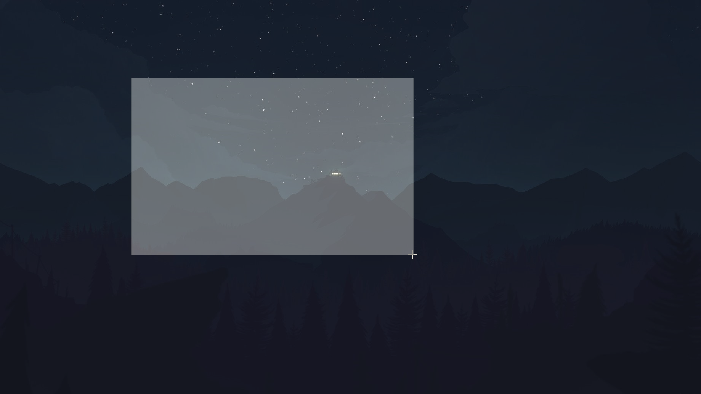

# Screenshoter

Simple screenshot application

## Table of contents

* [About the project](#about-the-project)
  * [Built With](#built-with)
* [Getting Started](#getting-started)
  * [Prerequisites](#prerequisites)
  * [Usage](#usage)

## About the project

It's a simple screenshot app that allows you to take screenshots in a easy way.

<p align="center">
  
</p>

### Built With

Application was built with:
* Python
  * PyQt5
  * Pillow

## Getting Started

### Prerequisites

Install the libraries with the command:

```sh
pip install -r requirements.txt
```
or:
```sh
python -m pip install -r requirements.txt
```

### Usage
1. Clone the repo:
```sh
git clone https://github.com/PibedeBarr10/screenshot-app.git
```
2. Open the app:
```sh
python app.pyw
```